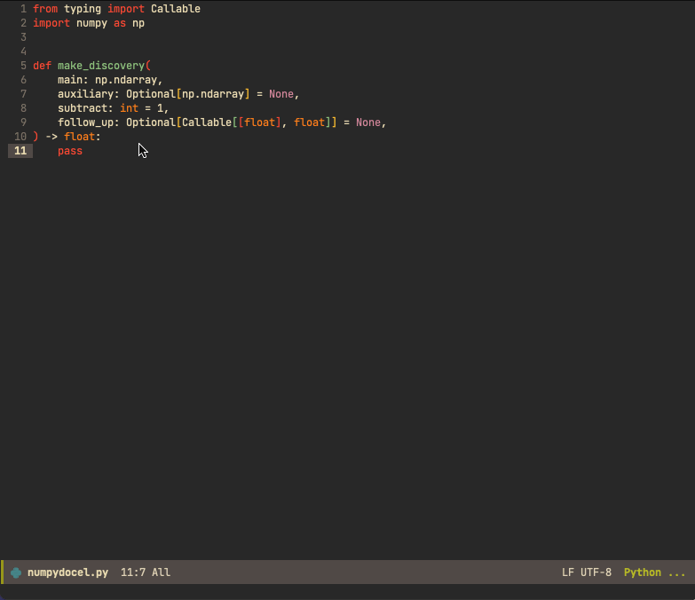

# numpydoc.el

An Emacs Lisp package to automatically insert NumPy style docstrings
for Python functions.

Calling `numpydoc-generate` will parse the function signature (for the
function corresponding to the current cursor location) and detects
argument names, argument type hints, and return type hints. The
default behavior is to prompt the user (in the minibuffer) for a
(short and long) description of the function, and a description for
each argument and the returned value. If the prompt is turned off some
(customizable) template text will be inserted into the docstring.

## Customization

See inside Emacs with <kbd>M-x customize-group RET numpydoc</kbd>.

<dl>
  <dt>numpydoc-prompt-for-input</dt>
  <dd>
  If true you will be prompted to enter a short description and long
  description, a description for each function argument, and a
  description for the return (if a return type hint is provided).
  </dd>
  <dt>numpydoc-quote-char</dt>
  <dd>
  Quote character to use (default is double quote, which is inspired
  by black formatting tool).
  </dd>
  <dt>numpydoc-insert-examples-block</dt>
  <dd>
  If true an Examples block will be added to the docstring.
  </dd>
  <dt>numpydoc-template-short</dt>
  <dd>
  Template text that will be used as the short description if
  numpydoc-prompt-for-input is nil.
  </dd>
  <dt>numpydoc-template-long</dt>
  <dd>
  Template text that will be used as the long description if
  numpydoc-prompt-for-input is nil.
  </dd>
  <dt>numpydoc-template-desc</dt>
  <dd>
  Template text that will be used for each function argument
  description if numpydoc-prompt-for-input is nil.
  </dd>
</dl>

## Example

An example function:

```python
def plot_histogram(
    x: np.ndarray,
    bins: int = 10,
    range: Optional[Tuple[float, float]] = None,
    weights: Optional[np.ndarray] = None,
    flow: bool = False,
    ax: Optional[plt.Axes] = None,
) -> Tuple[plt.Figure, plt.Axes]:
    pass
```

<kbd>M-x numpydoc-generate</kbd> with the default configuration
(prompt in minibuffer):

<p align="center">

</p>

Or, after <kbd>M-x numpydoc-generate</kbd> with
`numpydoc-prompt-for-input` set to `nil`:

```python
def plot_histogram(
    x: np.ndarray,
    bins: int = 10,
    range: Optional[Tuple[float, float]] = None,
    weights: Optional[np.ndarray] = None,
    flow: bool = False,
    ax: Optional[plt.Axes] = None,
) -> Tuple[plt.Figure, plt.Axes]:
    """FIXME: Short description.

    FIXME: Long description.

    Parameters
    ----------
    x : np.ndarray
        FIXME: Add docs.
    bins : int
        FIXME: Add docs.
    range : Optional[Tuple[float, float]]
        FIXME: Add docs.
    weights : Optional[np.ndarray]
        FIXME: Add docs.
    flow : bool
        FIXME: Add docs.
    ax : plt.Axes
        FIXME: Add docs.

    Returns
    -------
    Tuple[plt.Figure, plt.Axes]
        FIXME: Add docs.

    Examples
    --------
    FIXME: Add docs.

    """
    pass
```
