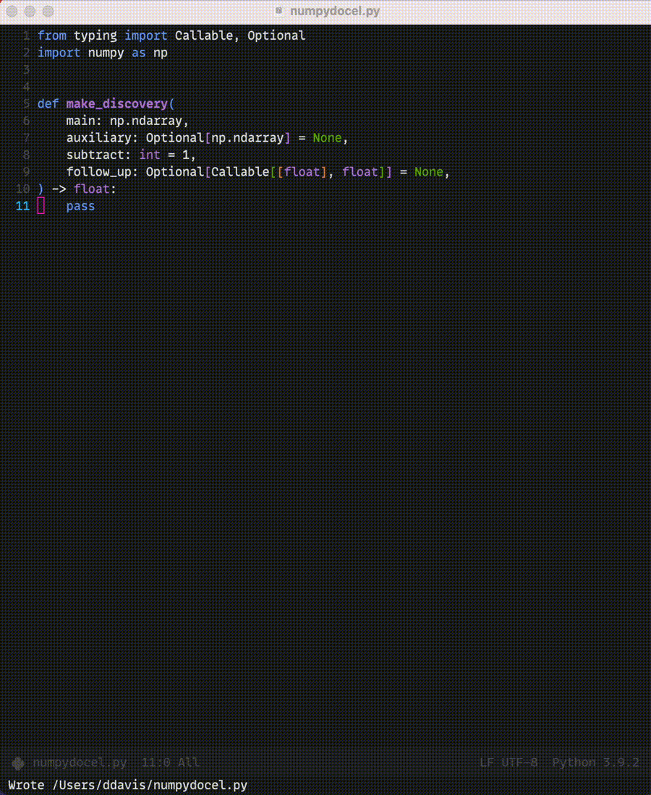
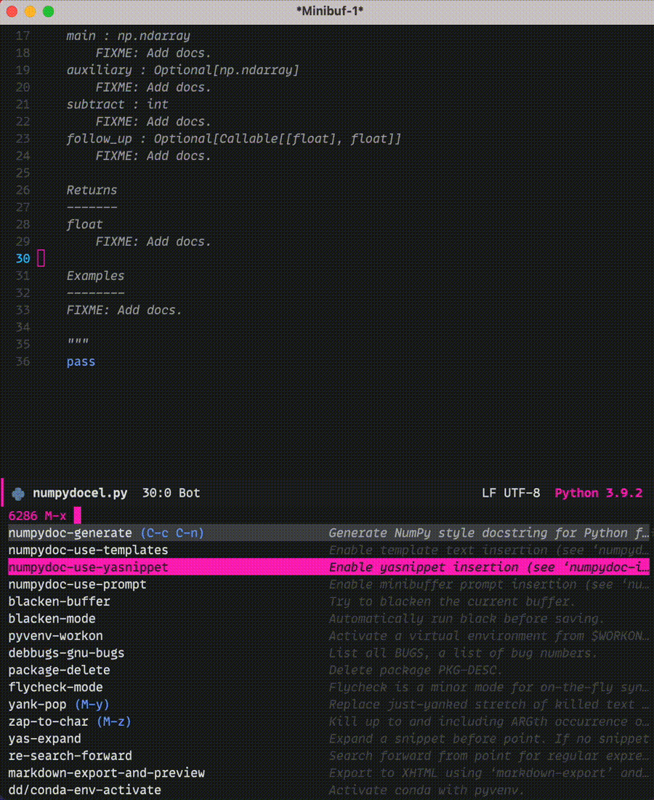

# numpydoc.el

[](https://melpa.org/#/numpydoc)
[](https://github.com/douglasdavis/numpydoc.el/actions/workflows/ci.yml)

An Emacs Lisp package to automatically insert [NumPy style
docstrings](https://numpydoc.readthedocs.io/en/latest/format.html) in
Python function definitions.

Calling `numpydoc-generate` parses the function at point (the cursor
can be anywhere in the function body). The parsing detects argument
names, type hints, exceptions, and the return type hint. This
information is used to generate a docstring.

The default behavior is to prompt the user (in the minibuffer) for a
short & long description of the function, a description for each
function argument, a description for each possible exception, and a
description for the return. It's also possible to either disable the
minibuffer prompt or use
[yasnippet](https://github.com/joaotavora/yasnippet) insertion. See
[customization](#customization) for more information. You'll also find
a few [examples](#examples) below. See the
[NEWS](https://github.com/douglasdavis/numpydoc.el/blob/main/NEWS.md)
file to see recent changes.

## Setup

Pick your favorite method of Emacs Lisp package setup:

```elisp
;; use-package with :ensure t to intall from MELPA.
(use-package numpydoc
  :ensure t)

;; use the straight.el package manager.
(straight-use-package 'numpydoc)

;; clone the git respository and require
(add-to-list 'load-path "/path/to/numpydoc.el")
(require 'numpydoc)

;; or point use-package to the local clone
(use-package numpydoc
  :load-path "/path/to/numpydoc.el")
```

The `C-c C-n` binding is vacant (not used in `python.el`, as of
writing this), so you may want to give yourself a convenient shortcut:

```elisp
;; with use-package
(use-package numpydoc
  :ensure t
  :bind (:map python-mode-map
              ("C-c C-n" . numpydoc-generate)))

;; without
(add-to-list 'load-path "/path/to/numpydoc.el")
(require 'numpydoc)
(define-key python-mode-map (kbd "C-c C-n") #'numpydoc-generate)
```

## Customization

View customizations without leaving Emacs via <kbd>M-x customize-group
RET numpydoc</kbd>

<dl>
  <dt>numpydoc-insertion-style</dt>
  <dd>
  The method used to insert components of the docstring (default is
  <code>'prompt</code>).
  <ul>
  <li> <code>'prompt</code> will trigger a request for each description
    in the minibuffer.</li>
  <li> <code>'yas</code> (requires <code>yasnippet</code> to be
    installed) will generate a template and call
    <code>yas-expand-snippet</code>, providing an insertion method
    familiar to <code>yasnippet</code> users.</li>
  <li> <code>nil</code> will disable any interactive insertion (template
    text will be inserted).</li>
  </ul>
  </dd>
  <dt>numpydoc-quote-char</dt>
  <dd>
  Quote character to use (the default is a double quote,
  <code>?\"</code>, used throughout the numpydoc docstring guide and
  the black formatting tool).
  </dd>
  <dt>numpydoc-insert-examples-block</dt>
  <dd>
  If <code>t</code> (the default) an Examples block will be added to
  the docstring.
  </dd>
  <dt>numpydoc-insert-parameter-types</dt>
  <dd>
  If <code>t</code> (the default) type hints from the function
  signature will be used to add a type to each argument in the
  Parameters block of the docstring.
  </dd>
  <dt>numpydoc-insert-raises-block</dt>
  <dd>
  If <code>t</code> (the default) a Raises bock will be added to the
  docstring if exceptions are detected in the function body.
  </dd>
  <dt>numpydoc-template-short</dt>
  <dd>
  Template text that will be used as the short description if
  <code>numpydoc-insertion-style</code> is <code>nil</code>.
  </dd>
  <dt>numpydoc-template-long</dt>
  <dd>
  Template text that will be used as the long description if
  <code>numpydoc-insertion-style</code> is <code>nil</code>.
  </dd>
  <dt>numpydoc-template-arg-desc</dt>
  <dd>
  Template text that will be used for each function argument
  description if <code>numpydoc-insertion-style</code> is
  <code>nil</code>.
  </dd>
  <dt>numpydoc-template-type-desc</dt>
  <dd>
  Template text that will be used for each function argument type
  description if <code>numpydoc-insertion-style</code> is
  <code>nil</code>.
  </dd>
</dl>

## Examples

<kbd>M-x numpydoc-generate</kbd> with the default configuration,
`numpydoc-insertion-style` set to `'prompt` (notice how long text is
automatically paragraph-filled):

<p align="center">
  
</p>

Using `yasnippet` (`numpydoc-insertion-style` set to `'yas`):

<p align="center">
  
</p>

With `numpydoc-insertion-style` set to `nil`; before:

```python
def plot_histogram(
    x: np.ndarray,
    bins: int = 10,
    range: Optional[Tuple[float, float]] = None,
    weights: Optional[np.ndarray] = None,
    flow: bool = False,
    ax: Optional[plt.Axes] = None,
) -> Tuple[plt.Figure, plt.Axes]:
    if weights is not None:
        if weights.shape != np.shape:
            raise ValueError("x and weights must have same shape.")
    pass
```

After <kbd>M-x numpydoc-generate</kbd>:

```python
def plot_histogram(
    x: np.ndarray,
    bins: int = 10,
    range: Optional[Tuple[float, float]] = None,
    weights: Optional[np.ndarray] = None,
    flow: bool = False,
    ax: Optional[plt.Axes] = None,
) -> Tuple[plt.Figure, plt.Axes]:
    """FIXME: Short description.

    FIXME: Long description.

    Parameters
    ----------
    x : np.ndarray
        FIXME: Add docs.
    bins : int
        FIXME: Add docs.
    range : Optional[Tuple[float, float]]
        FIXME: Add docs.
    weights : Optional[np.ndarray]
        FIXME: Add docs.
    flow : bool
        FIXME: Add docs.
    ax : Optional[plt.Axes]
        FIXME: Add docs.

    Returns
    -------
    Tuple[plt.Figure, plt.Axes]
        FIXME: Add docs.

    Raises
    ------
    ValueError
        FIXME: Add docs.

    Examples
    --------
    FIXME: Add docs.

    """
    if weights is not None:
        if weights.shape != np.shape:
            raise ValueError("x and weights must have same shape.")
    pass
```

## Similar packages

- [sphinx-doc.el](https://github.com/naiquevin/sphinx-doc.el): Inserts
  sphinx-compatible docstrings (does not offer customizations or
  automatically formatted insertions from the minibuffer or yasnippet).
- [docstr](https://github.com/jcs-elpa/docstr): Docstring insertion
  support for any programming language, including NumPy style Python
  (it has a programmable interface but requires a bit more setup to
  get the utility provided `numpydoc.el`).
